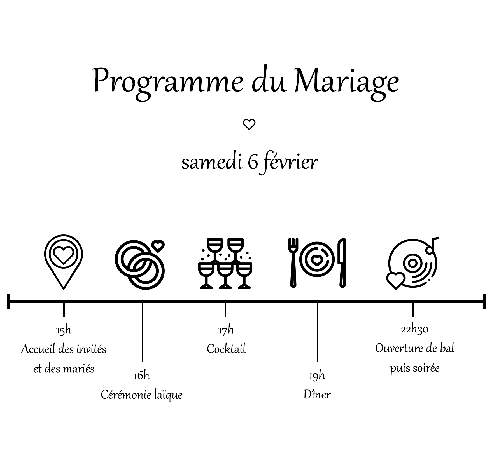
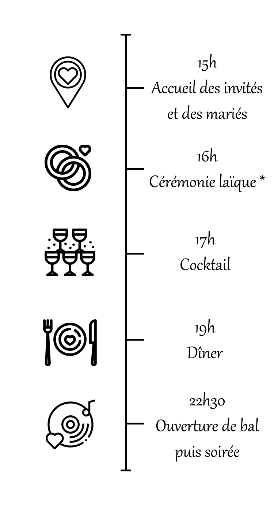
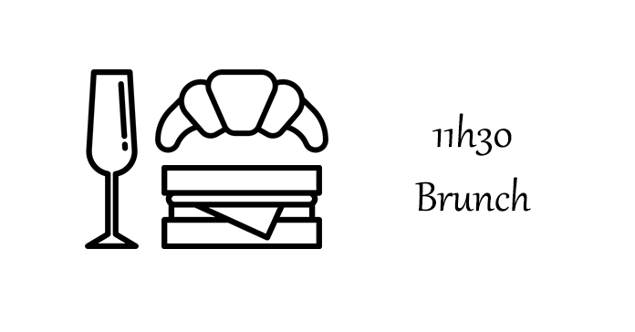
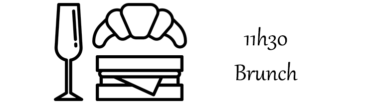

## {{page.title}}

### Programme du Mariage

### Samedi 6 février

 

### Dimanche 7 février

 

 

### Le mariage aura lieu au Château de Garde, à Moulon.

<iframe src="https://www.google.com/maps/embed?pb=!1m18!1m12!1m3!1d4758.121377013103!2d-0.21830238666508295!3d44.83794374170417!2m3!1f0!2f0!3f0!3m2!1i1024!2i768!4f13.1!3m3!1m2!1s0xd554532dc533345%3A0x6049a9547322ec03!2sCh%C3%A2teau%20de%20Garde!5e0!3m2!1sfr!2sfr!4v1595537776165!5m2!1sfr!2sfr" width="100%" height="400" frameborder="0" style="border:0;" allowfullscreen="" aria-hidden="false" tabindex="0"></iframe>
