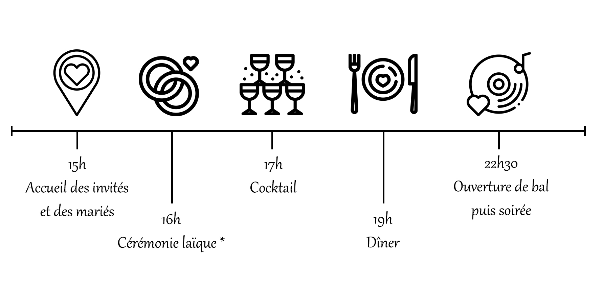

### Vendredi, bienvenue

{: .large width="4%"} 
{: .small width="15%"} 

### Samedi 11 décembre

{: .large width="80%"}
{: .small width="100%"}  
{: .large width="4%"} 
{: .small width="15%"} 

### Dimanche 12 décembre 

{: .large width="80%"}
{: .small width="100%" style="margin:25px 0"}  

{: .large width="4%"} 
{: .small width="15%"} 

### Le mariage aura lieu au [Château de Garde](https://chateaudegarde.com/), à Moulon.

#### * Qu'est-ce qu'une cérémonie laïque ? Elle représente pour nous le moment clé du Mariage, avec sa portée symbolique et romantique. C'est durant cette cérémonie que se fera l'échange des vœux et des alliances. Elle sera également l'occasion pour ceux qui le souhaitent de s'exprimer, avec un discours ou autre forme d'expression. Elle sera officiée par Jérôme, le frère de Julia.
